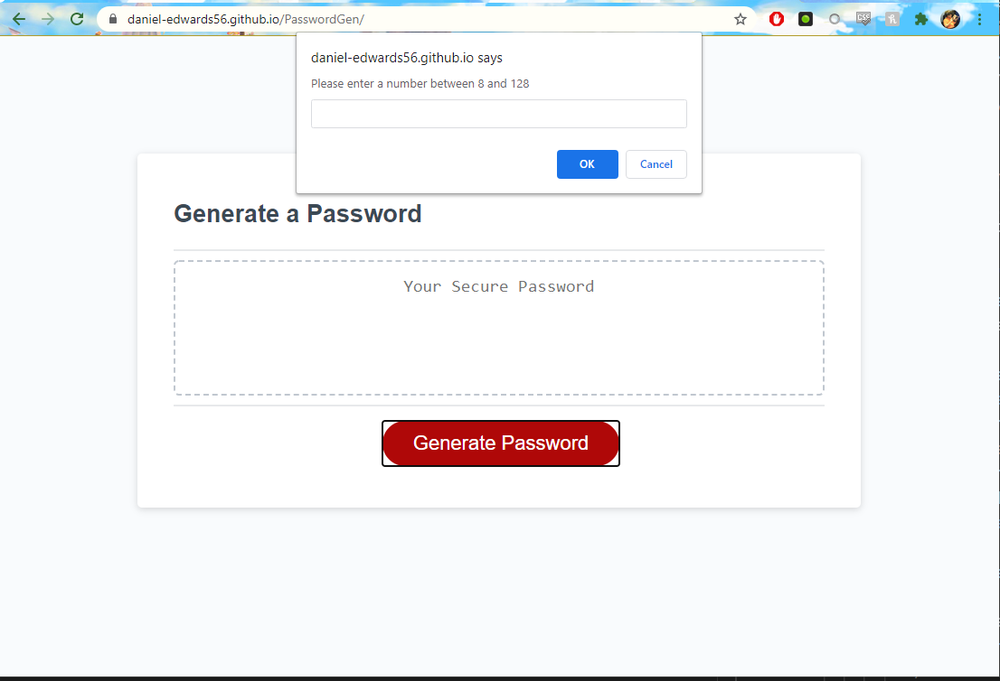

# PasswordGen

Url of deployed page:https://daniel-edwards56.github.io/PasswordGen/ 
in this web app the user has the ability to press a button to generate a series of prompts that ask the user how long and what type of characters they would like in a randomly generated password. After the user navigates these prompts the generated password wil be displayed for them on the intial webpage.

 

